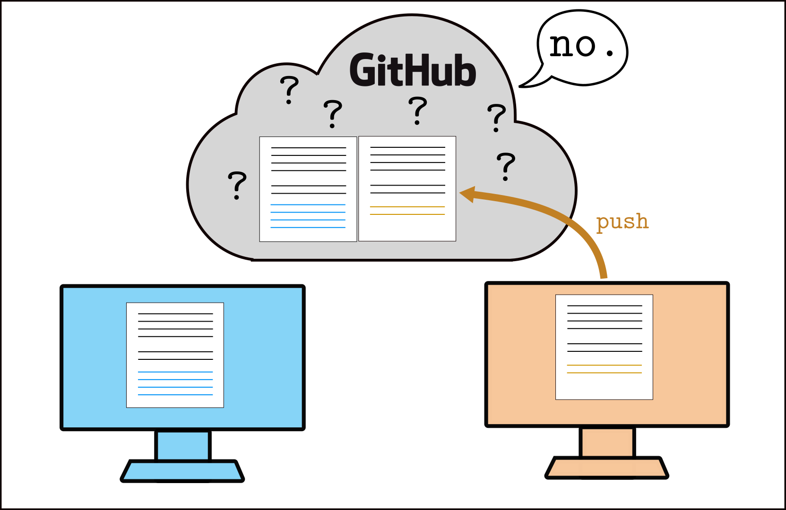
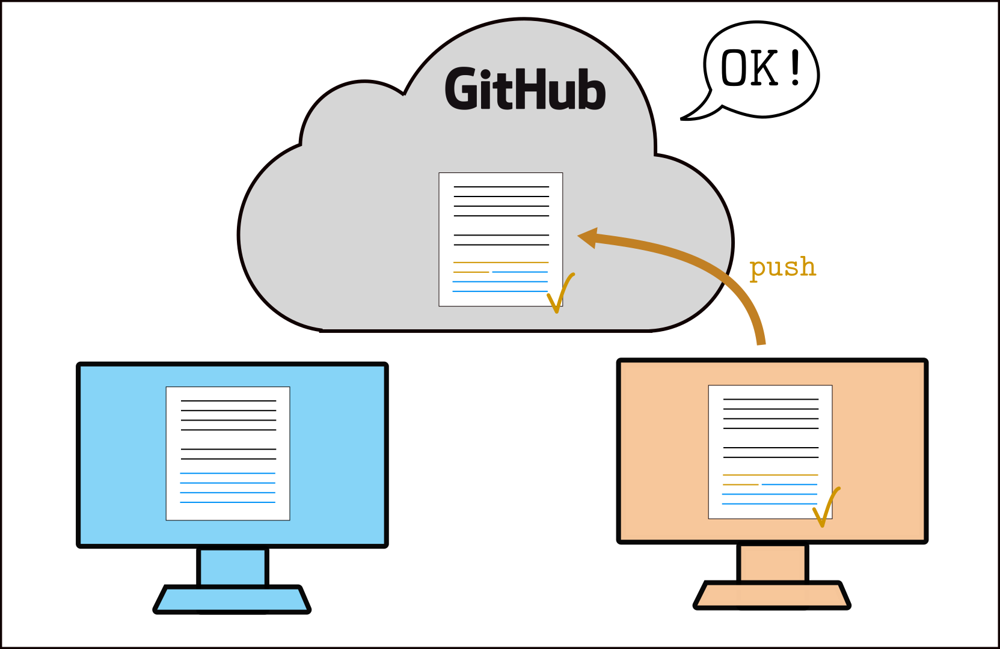

# Week 2 workshop - Fun with sequences

This week, you will practice using lists, loops, and functions in Python by looking at some interesting sequences in mathematics.

Like in Week 1, this week you will pair-program with another student. In the first exercise, you will learn what is a **merge conflict** and how to resolve it. In the second exercise, you will work together to implement some interesting sequences.

#### Roles

**Driver:** start sharing your screen if you haven't already, open Atom or VSCode (or other workflow of your choice -- this will be implied in all future mentions of "Atom or VSCode"), and clone this repo to your computer. **Navigator**: watch closely and read these instructions to the driver.

Today, try to **switch roles** every 15 minutes, or every time you finish a part of the task (whichever comes **first**: if you are still working on Task 1 after 15 minutes for example, switch roles anyway, and the navigator will pick up where the driver left off). Every time you switch roles, unless indicated otherwise, this is what you should do:
- the **driver** **saves** the files that have been edited (Ctrl+S or Cmd+S), **stages** their changes, **commits**, and **pushes** to the GitHub repo.
- after this, the **navigator** becomes the driver, starts **sharing their screen**, **pulls** the changes from GitHub (or **clones** the repo if they haven't already done so) using Atom or VSCode, and continues working on the task until the next switch.

**Note:** now that you have a little bit of experience with git and GitHub, we definitely recommend that you consult your editor's documentation on the subject, in case you're not sure how to do something using that editor:
- Atom: [GitHub package documentation](https://flight-manual.atom.io/using-atom/sections/github-package/)
- VSCode: [Using version control in VSCode](https://code.visualstudio.com/docs/editor/versioncontrol)

## Task 1: Generalised Fibonacci sequence

#### Driver:

You will see a script called `fibonacci.py` in your repo. In this file, where indicated, write a function named `p_q_fibo()`, which takes 3 input arguments:
- a positive integer `p`,
- a positive integer `q`,
- a positive integer `N` greater than 2,

and returns a list of the first `N` elements of the (p,q)-Fibonacci sequence F(n), defined by:

F(0) = F(1) = 1,

F(n) = p F(n-1) + q F(n-2), for n > 1.

There are already some tests in the script for you to check your answer -- you can write more of your own tests if you like. Run the code to check if the tests give the correct results. ([How do I run Python code in VSCode?](https://code.visualstudio.com/docs/python/python-tutorial#_run-hello-world))

> When you are happy with your function, or after around 15 minutes (whichever comes first!), **switch roles**.


## Task 2: Conflict resolution with git

In the Week 1 workshop, the task was written so that driver and navigator would take turns working on the shared code -- this was to avoid **merge conflicts**. A merge conflict happens when two (or more) people modify the same file, at the same time. Generally, you want to **avoid** merge conflicts -- but sometimes they happen, and it's useful to know how to resolve them. We're going to cause one on purpose.

- **Driver** and **navigator**, make sure you both have the latest version of your joint work on both your computers. If not, the **driver** should push their latest changes, and the **navigator** should pull these changes.
- **Driver** and **navigator**: if there isn't already one, **write a docstring** for the function `p_q_fibo()`. A docstring is a little bit of documentation for your function. There are examples of docstrings in the code-along video this week -- here is what it should look like:

```python
def p_q_fibo(p, q, N):
    '''
    This is the docstring. It starts with 3 quotation marks,
    it can be on multiple lines,
    and it ends with 3 quotation marks again.
    '''

    ...
```

Make sure you **each write a different docstring** (otherwise there won't be a conflict!). Both of you should **stage** and **commit** your changes -- **but don't push yet**.

- **Navigator**: push your changes on the GitHub repo. This should work without issues.
- **Driver**: check on the GitHub repo that the navigator's changes are there. Then, in Atom or VSCode, **try to push** your changes -- this should fail.

This is what is happening: you both start with the same files.


Then, the driver (orange) and navigator (blue) both make some changes locally, which they stage and commit. Now, each person's version is different from the original (still on GitHub), in a different way. The navigator (blue) pushes their changes, they are incorporated to the original file normally.


Then, the driver (orange) tries to push their changes -- but the original file has changed since the driver last pulled it, so git doesn't know which changes should be kept. This is a conflict.



- **Driver**: you now need to resolve the merge conflict. **Pull** the changes from GitHub, which will now also incorporate the navigator's changes. git will tell you that you need to **resolve the merge conflict** manually.


- **Navigator**: watch closely!
- **Driver:** in Atom or VSCode, open the file with the conflict (git should tell you which file it is -- in our case, it should be `fibonacci.py`. You will see something like this:


- **Driver:** your local changes are between `<<<<<<<< HEAD` and `========`. The navigator's changes (coming from GitHub) are between `========` and `>>>>>>>> ...`. Atom and VSCode should display some buttons you can click to directly choose either one or the other; you can also edit the file manually if you want to have a mix of the 2 versions.

- **Driver:** once you're satisfied with the changes, save the file, then **stage** and **commit** the changes. Congratulations -- you have now resolved the merge conflict! You can now push the changes on GitHub.



- **Navigator**: **pull** the changes from GitHub. You will now see the new changes, where the conflict was resolved by the driver. git doesn't complain here, because it knows that the conflict has been resolved.


#### That was a little bit painful...

The best way to handle merge conflicts is to try to **avoid** them as much as possible. Whenever you start or pick up your work, whenever you start changing files locally, **always start by fetching/pulling** the latest changes from GitHub. While you are working, you can also keep pulling changes regularly, just in case your teammate is also working on the same code at the same time -- this will ensure that if there has to be a merge conflict, it will be smaller and easier to resolve.

## Task 3: The Golomb sequence

If you still have some time today, here is another exercise. If it has been a while since you switched roles, now could be a good time.

- **Driver:** create a new file in the current folder (`pp-w02-workshop-...`), call it `golomb.py`. In this file, write a function `golomb_seq()` which takes 1 input argument, an integer `N` greater than 2, and returns all elements of the [Golomb sequence](https://en.wikipedia.org/wiki/Golomb_sequence) which are smaller than or equal to `N`.

Write some tests to make sure that your function returns the correct output for different values of `N`.

*Hint:* the sequence starts at n = 1, and the first 3 elements are G(1) = 1, G(2) = 2, and G(3) = 2.

> **Switch roles now**.

- (new) **driver:** in the file `golomb.py`, write a function `golomb_check()` which takes 1 input argument, an integer `N` greater than 2, and returns G(N), the `N`th element of the Golomb sequence, which can be calculated explicitly as the nearest integer to 


Compare this value to the `N`th element of the sequence generated by `golomb_seq()` -- it should be the same.
